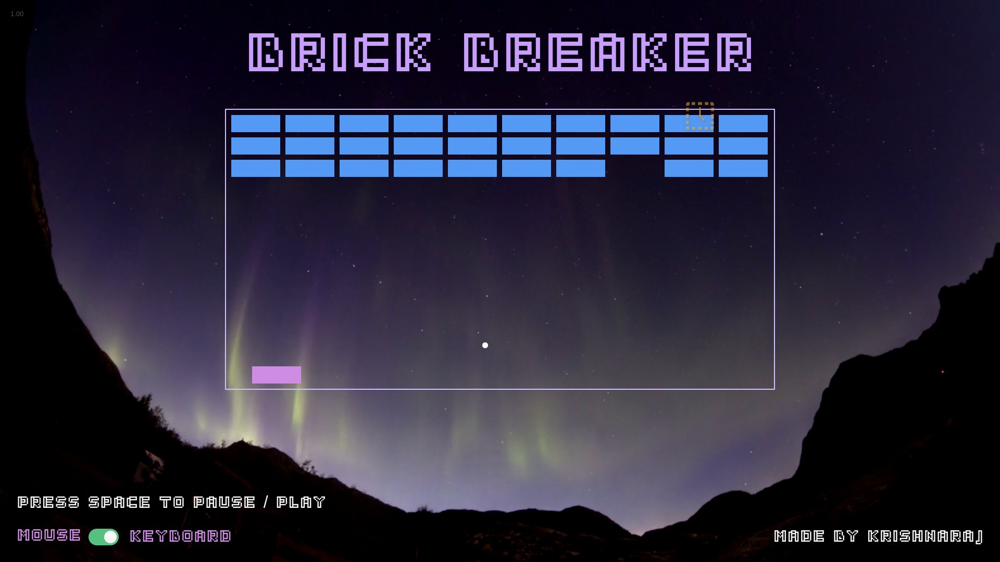

# Brick-Breaker
The classic Brick Breaker Game, in HTML, CSS and Js. It has always been one of my all time favourite games, and maybe thats why it was a joy to make it!

# Playing or Installation
1. Clone the Repository
2. Open the `index.html` file in your browser
3. Play the Game
4. Or just head over to [Its deployed Website!](http://brick_breaker.surge.sh) and Play!

# Screenshot

# GamePlay

# Credits
As Always, Thanks to tutorials from [The Free Code Camp.org](https://www.youtube.com/@freecodecamp) for their neverending help.
[This](https://www.youtube.com/watch?v=ec8vSKJuZTk&list=PLVzJm6SiAms8ghmF98T7bCiM7oAfA3uTW&index=13&t=5442s) video was referred. 

Music from: [Mixkit](https://mixkit.co/free-stock-music/tag/space/)
